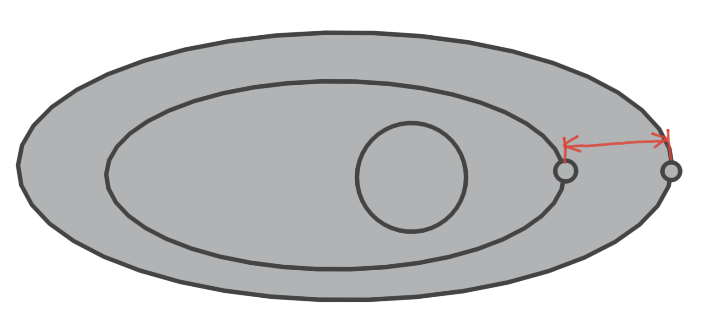

## 恒星

恒星到星系中心距离的概率分布函数(PDF)

$$
p(d) = 1 - d^{10}, d \in [0, 1]
$$

*$r$ 为星系半径的倍数*

恒星质量的概率分布函数(PDF)

$$
p(m) = -(1-m)^{400} + (1-m)^{30} + \frac{\sqrt{m}-m}{50}, m \in [0, 1]
$$

*$m$ 为太阳质量的倍数*

其他属性的分布通过插值得到

```rust
let spectral_type = mass_to_st[mass];
let prop_min = st_to_props[spectral_type - 1].prop;
let prop_max = st_to_props[spectral_type + 1].prop;
let prop = prop_min + (prop_max - prop_min) * rand::random::<f64>();
```

恒星系所含的行星数的分布函数

$$
f(x) = \frac{1}{1+e^{\frac{x-33}{12}}}\cdot10+1, x \in \{x|x \in \mathbb{N} \land 0 \le x \lt 67 \}
$$
此处 $x$ 为中心恒星的光谱类型索引

### 单位
见[`units_info.json`](../cosmos/assets/config/units_info.json)

1M☉ = 1.9891 * 10^30 kg
1R☉ = 6.957 * 10^8 m
1L☉ = 3.828 * 10^26 W

### 属性

见[`star_properties.json`](../cosmos/assets/config/star_properties.json)

## 行星

在生成行星时，保证最外层行星在

在同一行星系内，相邻行星的轨道在短轴上的增量的概率分布函数(PDF)，即下图中的红色线段部分



$$
p(r) = (2^{-x} - \frac{1}{100x})^{15}
$$

行星质量的概率分布函数(PDF)

$$
p(m) = 2\max(-\frac{m}{2}^5 + 10, 0) + \frac{\tanh(m-20) - \tanh(\frac{m}{100} - 1)}{5}, m \in [0, 1]
$$

*$m$ 为地球质量的倍数*
